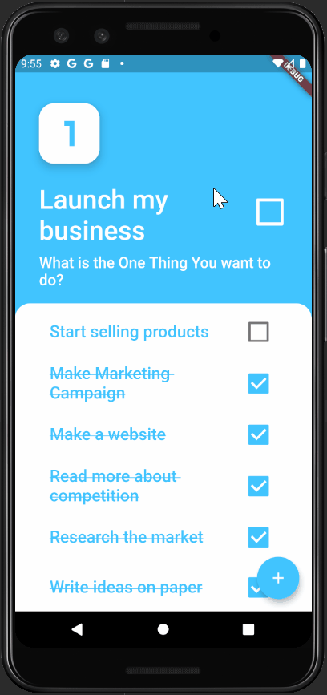

#One Thing

This is a productivity/planner app I made in Flutter. It is a to-do app with a simple twist, only one to-do item can be active at a time. A new to-do cannot be assigned until the previous one is completed or deleted.

Part of the app was made as project during a Flutter course which I took ( https://www.appbrewery.co/p/flutter-development-bootcamp-with-dart )
So I decided to expand on that app, adding my own features and make it usable for daily use.

I used Hive for persistence storage, Provider for State Management and toast messages to notify users.

I went through the whole process of making the app (from designing the logo, signing the app, all the way to pushing the app to the Play Store) on my own.
The app is not very popular (5+ downloads) but it is my own :) ( https://play.google.com/store/apps/details?id=com.davordev.one_thing&hl=en ).

